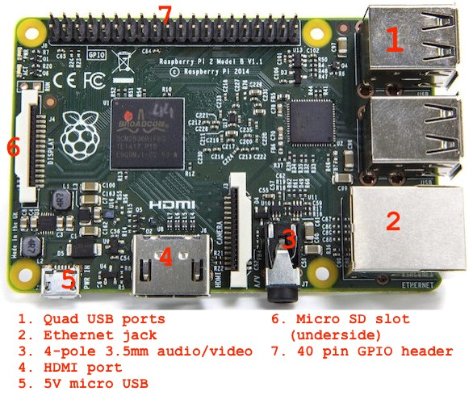

# Hackathon Overview
In this lab/hackathon we will be going through sensor labs to demonstrate connecting real world sensors to the middleware layer. Get your RaspberryPi up and running, and then try the labs referenced at the end of this overview.

## Getting Started
Follow these steps to get your RaspberryPi running:

* Unpack the RaspberryPi from the box
* Insert the SDHC card (6)
* Attach the ethernet cable to the hub and RaspberryPi (2)
* Unpack and plug in the power supply (5)

## Determining the IP address of the RaspberryPi
To determine the IP address of the you can try any of the following:

* Plug a headphone jack into the RCA/audio port of the Pi and listen for the computer to speak the address. It does this every minute.
* Plug in a USB flash drive into one of the USB ports, wait for 60 seconds, and then unplug the drive. On the root of the flash drive will be a file call IP that contains the phrase that the computer speaks. For example, for a wired address of 192.168.1.90, the IP file will contain:
	* ethernet address 1 9 2 dot 1 6 8 dot 1 dot 9 0

## Connecting to the RaspberryPi
Now that you have the IP address of the Pi, you can ssh into the device using ssh. The login username is root, and the password is root0FPi (root zero F P i).

	[tmp 510]$ ssh root@192.168.2.189
	root@192.168.2.189's password: 
	Linux raspberrypi 3.18.11-v7+ #781 SMP PREEMPT Tue Apr 21 18:07:59 BST 2015 armv7l
	
	The programs included with the Debian GNU/Linux system are free software;
	the exact distribution terms for each program are described in the
	individual files in /usr/share/doc/*/copyright.
	
	Debian GNU/Linux comes with ABSOLUTELY NO WARRANTY, to the extent
	permitted by applicable law.
	Last login: Wed Jun 10 05:56:09 2015 from scotts-imac
	root@raspberrypi:~#

You can perform all of the lab tasks using the ssh console.

### VNC
If you would like to bring up a desktop view, there is a vncserver script located in the root directory that you can run to start a VNC server session. 

	root@raspberrypi:~# cat vnc.sh 
	#!/bin/sh
	# client password is pivnc4me
	# port is 5901
	
	# Common display geometries
	# SXGA (1280x1024)
	# SXGA+ (1400x1050)
	# WSXGA+ (1680x1050)
	# UXGA (1600x1200)
	# WUXGA (1920x1200)
	
	# FHD (1920x1080) setting
	vncserver :0 -geometry 1920x1080 -depth 24 -dpi 72
	# QHD (2560x1440) setting
	#vncserver :1 -geometry 2560x1440 -depth 24 -dpi 72

Run the script after updating the geometry dimensions if desired, and then run the script:

	root@raspberrypi:~# ./vnc.sh 
	
	New 'X' desktop is raspberrypi:1
	
	Starting applications specified in /root/.vnc/xstartup
	Log file is /root/.vnc/raspberrypi:1.log
	
You can now connect to the vncserver instance using the pivnc4m password. If your Pi's IP is 192.168.1.189, you would connect to it using a vnc url like vnc://192.168.2.189:5901. On a MAC, you could enter a URL into the Finder's "Connect to Server..." dialog. On Fedora/RHEL, you can use the Internet/Remote Viewer application.

# Project Repositories
There are two git repositories that we will be working with in this lab. A summary of each and links to the repo readme files can be found below. Note that the projects can be found on the system image of your RaspberryPi under the /root/Labs directory, but you will probably want to update it by doing a `git pull` from within each repository to pickup any last minute changes.

## Passive Infrared Motion Sensor, HC-SR501
The [Passive Infrared Motion Sensor, HC-SR501](https://github.com/burrsutter/rpi_HC-SR501/blob/master/README.md) project connects an HC-SR501 infrared sensor to the RaspberryPi GPIO pins to allow for motion detection using either polling or trigger event notifications. Follow the above link to the project README to get started.

## Temperature Sensor, DS18B20
The [1-wire Temperature Sensor, DS18B20](https://github.com/burrsutter/rpi_DS18B20/blob/master/README.md) project connects a DS18B20 sensor to the RaspberryPi filesystem using the 1-wire bus and filesystem driver to access the sensor temperature reading. Follow the above link to the project README to get started.
